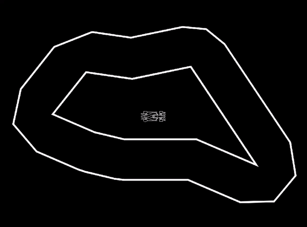

# Fuzzy Logic Autonomous Car

This project is a simulation of an autonomous car using Pygame, numpy, and skfuzzy (SciKit-Fuzzy) for fuzzy logic control. The simulation features a car that can be manually controlled or set to autopilot, which uses fuzzy logic to navigate a track.

## Features

- **Manual and Autopilot Mode**: Start with manual control and toggle to autopilot with a simple key press.
- **Customizable Car and Track**: Easily change the car and track by modifying the `TRACK_NAME` and `CAR_NAME` variables.
- **Real-time Collision Detection**: Utilizes raycasting for collision detection with the track boundaries.
- **Fuzzy Logic Control**: Autopilot mode uses fuzzy logic to determine steering angles based on detected distances from track boundaries.

## Getting Started

### Prerequisites

You will need Python 3.x and the following libraries:
- Pygame
- NumPy
- SciKit-Fuzzy (skfuzzy)

You can install the necessary libraries using pip:

```bash
pip install pygame numpy scikit-fuzzy
```

### Installation

1. Clone the repository or download the source code:
   ```bash
   git clone https://your-repository-link
   cd your-repository-directory
   ```

2. Modify the `TRACK_NAME` and `CAR_NAME` in the script to point to your desired track and car images. You can generate different track designs at [OpenProcessing Track Generator](https://openprocessing.org/sketch/2307416).

### Running the Simulation

To run the simulation, execute the following command from the root of the project directory:

```bash
python3 car_simulation.py
```

### Controls

- **Arrow Keys**: Move the car manually (Up = forward, Down = reverse, Left = turn left, Right = turn right).
- **Space**: Toggle autopilot on/off.

### Customizing Your Simulation

- **Change the Track or Car**: 
  - To change the track, modify the `TRACK_NAME` variable to the filename of your new track image located under the `Tracks` directory.
  - To change the car, modify the `CAR_NAME` variable to the filename of your new car image located under the `Cars` directory.

## How It Works

The car's autopilot uses fuzzy logic to make decisions based on the input from multiple raycasts that detect the distance to the track boundaries. These distances are processed through a fuzzy logic controller that outputs the steering direction and speed adjustments.

## License

This project is open source and available under the [MIT License](LICENSE).
